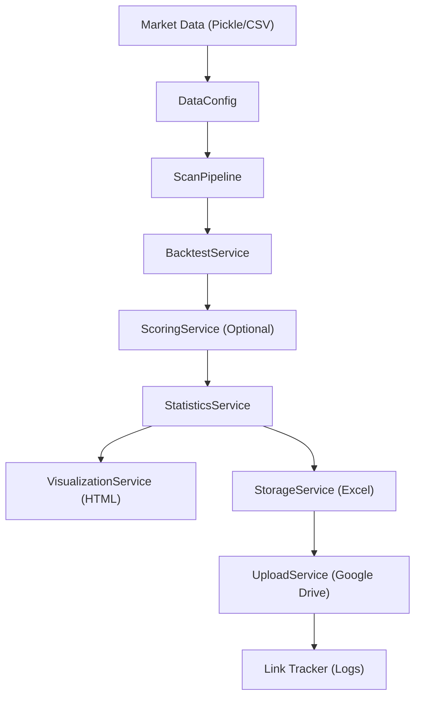
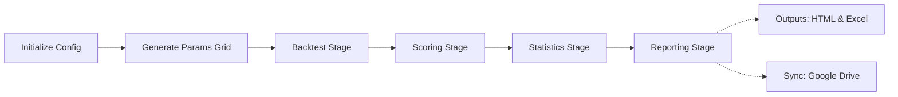

# GigaAlpha

**High-performance, service-oriented quantitative trading strategy backtesting engine with automated analytics and cloud synchronization**

GigaAlpha is a specialized research framework designed for rapid strategy exploration and rigorous quantitative analysis. It integrates multi-core parallel execution with automated evaluation services and cloud-based persistence.

## Architecture At A Glance



The system generates two primary artifact types for different research workflows:

| Artifact Type | Purpose | Canonical Destination | Typical Use Case |
| --- | --- | --- | --- |
| Storage (.xlsx) | Time-series metrics and log retention | Google Drive | Archival, deep-dive tabular evaluation, and sharing |
| Visualization (.html) | High-dimensional surface investigation | Local outputs/html/ | Plotly 3D hyperparameter tuning and observation |

## Core Concepts

### 1. Granular Execution Pipeline
The pipeline is decomposed into independent, atomic phases: Core Backtest, Scoring Computation, and Statistics Summary. Each phase is independently timed and logged, allowing for precise performance monitoring and easier debugging.

### 2. Robust Error Handling and Diagnostics
GigaAlpha implements advanced error trapping that captures full tracebacks and problematic configuration metadata at each step. If an individual backtest fails, the system logs the exact cause and continues processing the remaining grid without interruption.

### 3. Service-Oriented Architecture (SOA)
Functional logic is encapsulated in state-agnostic services (e.g., BacktestService, ScoringService). This decoupling allows the core engine to be highly flexible and easy to extend with new analytical layers.

### 4. Portable Professional Helpers
Centralized helpers like System and Timer are designed for maximum portability. Features such as the Vietnam Timezone (GMT+7) converter are standardized across the framework to ensure consistent diagnostic audit trails.

## Functional Runtime Flow



## Setup

### Prerequisites

Ensure you have a clean Python 3.8+ environment:

```bash
git clone https://github.com/Thanhnt15/GigaAlpha.git
cd GigaAlpha
python3 -m pip install -r requirements.txt
```

### Authentication

Configure your environment settings:

```bash
cp .env.example .env
```

Ensure GDRIVE_TOKEN_PATH correctly maps to your OAuth2 token file to enable automated cloud synchronization.

## Usage

### Systematic Scan
Launch the parallel execution pipeline using a YAML configuration:

```bash
python gigaalpha/scripts/scan.py --config configs/default.yaml
```

### Professional Debug Sandbox
For rapid iteration without YAML overhead or persistent file logging:

```bash
python gigaalpha/scripts/debug_run.py
```

## Configuration Model

Pipeline behavior is defined in `configs/default.yaml` with the following structured sections:

- data: Source data paths and segment definitions.
- backtest: Alpha/Generator selection and concurrency (cores) settings.
- compute_score: K-Neighbors scoring thresholds.
- storage/visualize: Local artifact generation toggles.
- upload: Google Drive target folder definitions.

## Project Layout

```text
gigaalpha/
├── core/            Fundamental engine logic (Simulators, Registries)
├── helpers/         Portable standalone utilities (System, Timer, Drive)
├── scripts/         CLI entry points (scan.py, debug_run.py)
├── services/        Domain orchestrators (Backtest, Scoring, Statistics, Sync)
├── utils/           Functional utilities and configuration loaders
configs/             YAML behavioral definitions
docs/                Technical specifications and guides
outputs/             Generated manifests (HTML, XLSX)
logs/                System diagnostics and Vietnam Time audit trails
```

## License

MIT. See LICENSE for details.
