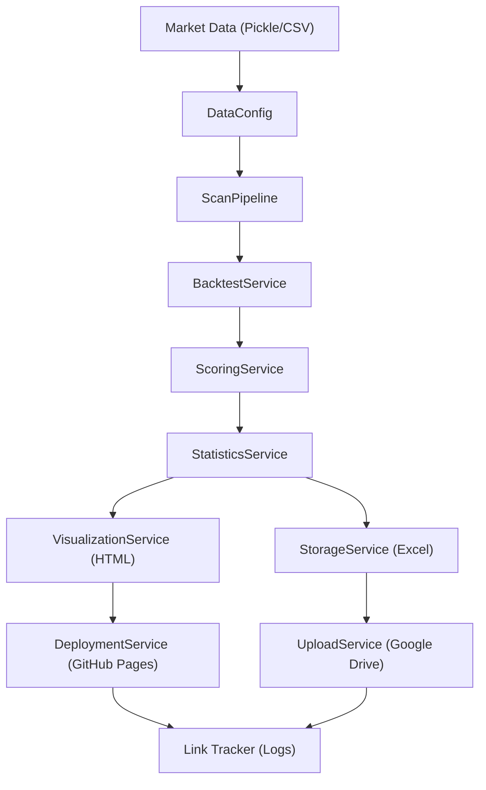
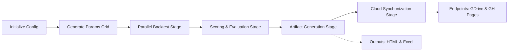

# GigaAlpha

**High-performance, service-oriented quantitative trading strategy backtesting engine with automated analytics and cloud synchronization**

[](https://www.python.org/downloads/)
[](LICENSE)

GigaAlpha is a research framework for rapid strategy exploration and quantitative analysis. It combines:

- a multi-core parallel execution pipeline
- an automated evaluation and scoring service
- interactive 3D visualization artifacts
- direct cloud synchronization for analytics reports (Google Drive, GitHub Pages)
- [Cloud Synchronization Guide](docs/CLOUD_SYNC_GUIDE.md)
- a modular service-oriented architecture (SOA)

## Repository Status

Current implementation highlights:

- Python 3.8+ native compatibility
- Parallelized core backtest orchestration over extensive parameter arrays
- Fully decoupled visualization, storage, and deployment services
- [Detailed Cloud Setup Guide](docs/CLOUD_SYNC_GUIDE.md)

## Documentation Map

- [Cloud Synchronization Guide](docs/CLOUD_SYNC_GUIDE.md)

## Architecture At A Glance



Two independent artifact persistence lanes share the computation results:

| Lane | Purpose | Canonical Destination | Typical use |
| --- | --- | --- | --- |
| Storage Lane | Time-series metrics and log retention | Google Drive (`.xlsx`) | Archival, programmatic retrieval, deep-dive tabular evaluation |
| Visualization Lane | Rapid visual surface investigation | GitHub Pages (`.html`) | Plotly 3D hyperparameter tuning and non-parametric observation |

## Core Concepts

### 1. Parallel Backtesting Pipeline
Leverages `multiprocessing` to distribute discrete strategy parameter branches across CPU cores. It mitigates bottleneck constraints and reduces exhaustive parameter searches from hours to minutes.

### 2. Service-Oriented Architecture (SOA)
Atomic services orchestrate functional logic (e.g., `backtest_service.py`, `scoring_service.py`, `upload_service.py`). These state-agnostic services decouple execution phases from core data bindings.

### 3. Automated Cloud Synchronization
Integrated persistence handlers autonomously deploy structural artifacts to pre-configured endpoints, ensuring research environments persist correctly without manual operational intervention.

## Canonical Runtime Flow



## Setup

### Prerequisites

```bash
git clone https://github.com/Thanhnt15/GigaAlpha.git
cd GigaAlpha

python3 -m pip install -r requirements.txt
```

### Credentials & Keys

Replicate the environment schema to authenticate respective external services:

```bash
cp .env.example .env
```

Ensure `GDRIVE_TOKEN_PATH` securely maps to your validated OAuth2 token (`.pickle` or `.json`), permitting the `UploadService` necessary file/folder scopes.

## Quick Start

### Execute the Scan Pipeline

Launch the main parallel execution branch relying on the baseline profile:

```bash
python gigaalpha/scripts/scan.py --config configs/default.yaml
```

### Common Workflows

#### Extensive Grid Validation
Invoke the workflow on the exhaustive parameter boundaries layout:

```bash
python gigaalpha/scripts/scan.py --config configs/scan_large.yaml
```

## Configuration Model

The canonical pipeline configuration resides within `configs/default.yaml`.

Top-level structured sections:

- `data`: Path to source derivatives (`pickle` format optimally).
- `backtest`: Generator targets and concurrency constraints.
- `compute_score`: Sub-module thresholds for neighbor-based rankings.
- `deploy`: Target definitions for remote repositories.

Important infrastructural properties:
- `backtest.cores`: Bound concurrency scale vertically relative to CPU topology.
- `deploy.branch`: Default constraint points to standard `gh-pages` convention.

## Project Layout

```text
gigaalpha/
├── core/            Fundamental engine logic and search limits definition
├── helpers/         Third-party integrators (Git protocols, Google Auth endpoints)
├── scripts/         CLI entry points
├── services/        Domain orchestrators (Execution, Sync, Plotting)
├── utils/           Side-effect free functional utilities and formatting constants
configs/             YAML behavioral definitions
docs/                Technical specifications
outputs/             Ephemeral artifacts and metric manifestations (git ignored)
logs/                Diagnostics arrays and HTTP sync records (git ignored)
```

## License

MIT. See [`LICENSE`](LICENSE).
