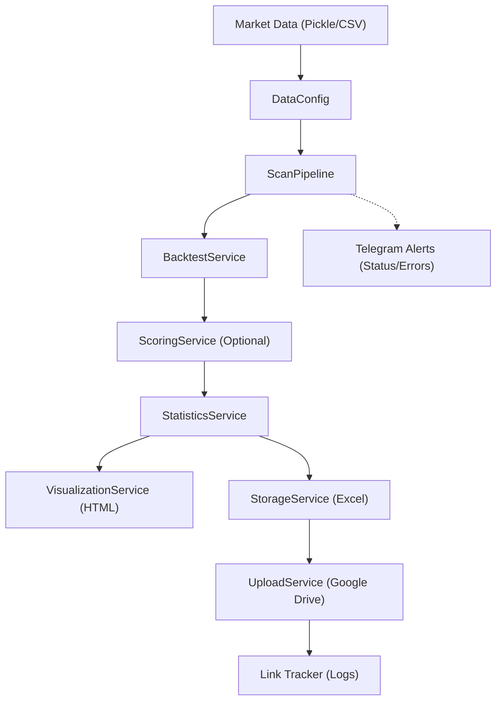
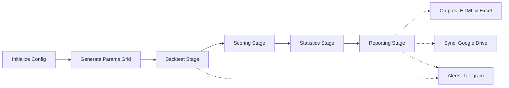

# GigaAlpha

GigaAlpha is a high-performance, modular quantitative research and strategy backtesting framework specialized for **Stock Derivatives**. It is designed for scalable parameter exploration, automated secondary scoring, and seamless cloud-based lifecycle management of sophisticated financial engineering models.

## Project Overview

The core objective of GigaAlpha is to facilitate a professional-grade research-to-production pipeline for quantitative traders and financial engineers. Unlike traditional backtesters, GigaAlpha is built to handle the complexities of derivative products and supports advanced data abstraction modalities including:

- **Time-Series Data**: Standard periodic sampling.
- **Volume Bars**: Sampling based on trade intensity to mitigate heteroscedasticity.
- **Dollar/Value Bars**: Sampling based on market value exchange to better capture institutional order flow.

By leveraging a service-oriented architecture (SOA) and parallelized execution engines, it transforms complex parameter grid searches into structured, risk-adjusted actionable intelligence.

## Architecture At A Glance



The system generates two primary artifact types for different research workflows:

| Artifact Type | Purpose | Canonical Destination | Typical Use Case |
| --- | --- | --- | --- |
| Storage (.xlsx) | Time-series metrics and log retention | Google Drive | Archival, deep-dive tabular evaluation, and sharing |
| Visualization (.html) | High-dimensional surface investigation | Local outputs/html/ | Plotly 3D hyperparameter tuning and observation |

## Monitoring & Alerts

GigaAlpha incorporates a centralized notification system to keep you updated on the pipeline's progress and health.

-   **Real-time Notifications**: Receive instant updates via Telegram for both successful completions and system warnings/errors.
-   **Unattended Operation**: Designed for stable, long-running research tasks with automated diagnostic reporting.

> [!TIP]
> See the [Telegram Setup Guide](docs/telegram_setup.md) for quick integration steps.

## Advanced Data Lifecycle Management

The system generates two primary artifact types for different research workflows:

| Artifact Type | Purpose | Canonical Destination | Typical Use Case |
| :--- | :--- | :--- | :--- |
| **Storage (.xlsx)** | Metric retention & detailed logs | Google Drive / Local | Deep-dive tabular evaluation & archival |
| **Visualization (.html)** | High-dimensional surface investigation | Local `outputs/html/` | Plotly 3D hyperparameter tuning |

## Functional Runtime Flow



## Getting Started

### 1. Prerequisites
Ensure you have a clean **Python 3.8+** environment. It is recommended to use a virtual environment or a dedicated Conda environment.

```bash
git clone https://github.com/Thanhnt15/GigaAlpha.git
cd GigaAlpha
python3 -m pip install -r requirements.txt
```

### 2. Environment Configuration
GigaAlpha utilize a centralized configuration strategy via a `.env` file. Initialize yours by cloning the example:

```bash
cp .env.example .env
```

### 3. Authentication & Integration
- **Google Drive**: Ensure `GDRIVE_TOKEN_PATH` in `.env` points to your validated OAuth2 credentials.
- **Telegram Monitoring**: Follow the [Telegram Setup Guide](docs/telegram_setup.md) to enable real-time alerting.

## Workflow Execution

### Systematic Scan Pipeline
The production-grade entry point for large-scale grid searches:
```bash
python gigaalpha/scripts/scan.py --config configs/default.yaml
```

### Research Sandbox
A lightweight entry point for rapid Alpha iteration without YAML overhead:
```bash
python gigaalpha/scripts/debug_run.py
```

## Configuration Model

Pipeline behavior is governed by structured YAML profiles in `configs/`:
- **data**: Data ingestion paths and time-series segments.
- **backtest**: Alpha definitions and concurrency (`cores`) throttling.
- **compute_score**: K-Neighbors performance thresholds.
- **upload**: Cloud target destination and metadata settings.

## Project Layout

```text
gigaalpha/
├── core/            Fundamental engine logic (Simulators, Registries)
├── helpers/         Portable standalone utilities (System, Timer, Drive)
├── scripts/         CLI entry points (scan.py, debug_run.py)
├── services/        Domain orchestrators (Backtest, Scoring, Statistics, Sync)
├── utils/           Functional utilities and configuration loaders
configs/             YAML behavioral definitions
docs/                Technical specifications and guides
outputs/             Generated manifests (HTML, XLSX)
logs/                System diagnostics and sentinel files
```

For a deep dive into the internal execution logic, see the [Project Workflow Document](docs/project_workflow.md).

## License

MIT. See LICENSE for details.
