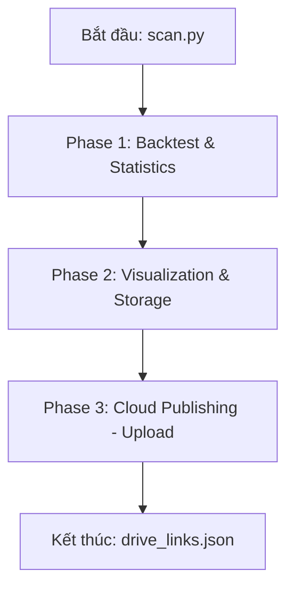

# 🚀 GigaAlpha Workflow Architecture

Tài liệu này mô tả chi tiết luồng hoạt động của dự án GigaAlpha, từ lúc khởi chạy cấu hình cho đến khi báo cáo được đẩy lên Google Drive.

## 📌 Tổng quan luồng xử lý (Workflow Pipeline)

Quy trình hoạt động được điều phối chính bởi tệp `scan.py`. Một chu kỳ chạy bao gồm 3 Giai đoạn (Phases) chính:

---

## 🛠 Chi tiết các Giai đoạn

### 1. Phase 1: Backtest & Analytics (`run_backtest_and_statistics`)
Đây là giai đoạn nặng nhất về tính toán, sử dụng đa nhân (multiprocessing) để quét các Alpha.

- **Dịch vụ sử dụng**: `BacktestService`, `ScoringService`, `StatisticsService`.
- **Luồng đi**:
    1. **Load Config**: Đọc `default.yaml` để lấy danh sách alpha, bar_size, segments.
    2. **Generate Params**: `ScanParams.gen_all_params` tạo ra hàng nghìn tổ hợp tham số từ Registry.
    3. **Simulation**: `BacktestService` gọi `Simulator` (Core) để chạy backtest song song.
       - Mỗi Alpha được tính toán: `Signal` -> `Position` -> `TVR/Fee` -> `Profits`.
    4. **Scoring**: `ScoringService` tính toán điểm Sharpe và các độ đo hiệu quả.
    5. **Stats Summary**: In bảng tổng hợp kết quả (Sharpe > 0, 1, 2, TVR mean) ra Terminal.

### 2. Phase 2: Reporting (`run_visualization_and_storage`)
Giai đoạn này chuyển đổi dữ liệu thô thành các báo cáo trực quan.

- **Dịch vụ sử dụng**: `VisualizationService`, `StorageService`.
- **Luồng đi**:
    1. **Parallel Workers**: Chia dữ liệu theo từng `segment` để xử lý song song.
    2. **Visual**: `VisualizationService` tạo biểu đồ 3D tương tác (HTML).
    3. **Excel**: `StorageService` xuất dữ liệu chi tiết ra file `.xlsx` với format chuyên nghiệp.
    4. **Output**: Lưu vào thư mục `outputs/excel/Gen_X/` và `outputs/html/Gen_X/`.

### 3. Phase 3: Cloud Publishing (`run_upload_to_drive`)
Giai đoạn tự động hóa việc đưa kết quả lên Cloud.

- **Dịch vụ sử dụng**: `UploadService`, `LinkTracker`.
- **Luồng đi**:
    1. **Scanning**: Tìm tất cả file Excel vừa tạo trong thư mục output.
    2. **Parallel Upload**: `UploadService` gọi `GDrive` helper để đẩy file lên thư mục Google Drive định sẵn.
    3. **Permissions**: Tự động mở quyền Public View hoặc cấp quyền Editor theo cấu hình.
    4. **Tracking**: `LinkTracker` thu thập các đường dẫn (URL) Google Sheet và ghi vào `outputs/excel/drive_links.json`.

---

## 📂 Sơ đồ gọi hàm (Call Stack Reference)

| Entry Point | Core / Service Called | Mục đích |
| :--- | :--- | :--- |
| `scan.py` | `PipelineConfig.load()` | Đọc và chuẩn hóa cấu hình từ YAML |
| `BacktestWorkflow` | `BacktestService.run_parallel()` | Kích hoạt quét đa nhân |
| `BacktestService` | `Simulator.execute_pipeline()` | Logic tính toán Backtest lõi |
| `Simulator` | `AlphaDomains` | Thư viện toán học tính toán PnL, TVR |
| `BacktestWorkflow` | `ScoringService.run_parallel()` | Chạy thuật toán chấm điểm Alpha |
| `run_upload_to_drive` | `UploadService` | Giao tiếp với Google Drive API |
| `LinkTracker` | `System.get_now_vn()` | Lấy thời gian chuẩn Việt Nam để log |

---

## 💾 Quản lý dữ liệu (Data IO)
- **Input**: Nhận file `.pickle` (ví dụ: `data/dic_range_bar.pickle`) chứa dữ liệu giá OHLC.
- **Config**: Tất cả hành vi nằm trong `configs/default.yaml`.
- **Logs**: Mọi hoạt động được ghi vào `logs/backtest.log` để debug.
