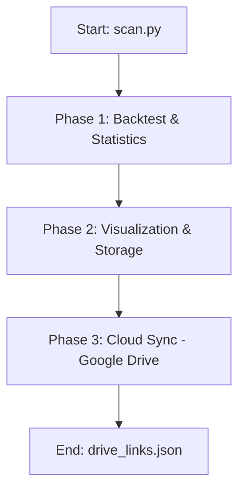

# 🚀 GigaAlpha Workflow Architecture

This document describes the detailed execution flow of the GigaAlpha project, from configuration initialization to report synchronization with Google Drive.

## 📌 Workflow Pipeline Overview

The execution process is primarily orchestrated by the `ScanPipeline` class (found in `pipeline_service.py`). A full cycle consists of 3 major Phases:

---

## 🛠 Phase Details

### 1. Phase 1: Backtest & Analytics (`run_backtest_and_statistics`)
This is the most computationally intensive phase, utilizing multiprocessing to scan Alpha strategies.

- **Services Used**: `BacktestService`, `ScoringService`, `StatisticsService`.
- **Workflow**:
    1. **Load Config**: Reads the YAML configuration (e.g., `scan_large.yaml`) to retrieve the list of alphas, frequencies, and segments.
    2. **Generate Params**: `ScanParams.gen_all_params` creates thousands of parameter combinations from the registry.
    3. **Simulation**: `BacktestService` runs parallel backtests across CPU cores.
    4. **Scoring**: `ScoringService` computes Sharpe scores and performance rankings (Neighbor-based scoring).
    5. **Stats Summary**: Prints a summary table (Sharpe > 0, 1, 2, mean TVR) to the terminal.

### 2. Phase 2: Reporting (`run_visualization_and_storage`)
This phase transforms raw computation data into interactive visualizations and structured reports.

- **Services Used**: `VisualizationService`, `StorageService`.
- **Workflow**:
    1. **Parallel Workers**: Splits data by `segment` for parallel processing.
    2. **Visual**: `VisualizationService` generates interactive 3D charts (.html) saved in `outputs/html/`.
    3. **Excel**: `StorageService` exports detailed metrics to professional `.xlsx` files in `outputs/excel/`.

### 3. Phase 3: Cloud Sync (`run_upload_to_drive`)
Automates the distribution of results to Google Drive.

- **Services Used**: `UploadService`, `LinkTracker`.
- **Workflow**:
    1. **Scanning**: Identifies all newly created Excel files in the output directory.
    2. **Parallel Upload**: `UploadService` pushes files to Google Drive using the `GDrive` helper.
    3. **Tracking**: `LinkTracker` records the generated URLs in `logs/drive_links.json`.

---

## 📂 Call Stack Reference

| Entry Point | Core / Service Called | Purpose |
| :--- | :--- | :--- |
| `scan.py` | `PipelineConfig.load()` | Load and normalize YAML configuration |
| `ScanPipeline` | `BacktestService.run_parallel()` | Activate multi-core scan |
| `BacktestService` | `Simulator.execute_pipeline()` | Core backtest mathematical logic |
| `ScanPipeline` | `ScoringService.run_parallel()` | Run Alpha scoring algorithms |
| `ScanPipeline` | `run_upload_to_drive()` | Interface with Google Drive API |
| `LinkTracker` | `System.get_now_vn()` | Retrieve timestamp for link logging |

---

## 💾 Data Management (Data IO)
- **Input**: Accepts `.pickle` files (e.g., `data/dic_freqs_alpha_base.pkl`) containing price data.
- **Config**: Flexible behavioral definitions via YAML files in the `configs/` directory.
- **Artifacts**: Generated HTML and Excel files reside in `outputs/` (managed via `.gitignore`).
