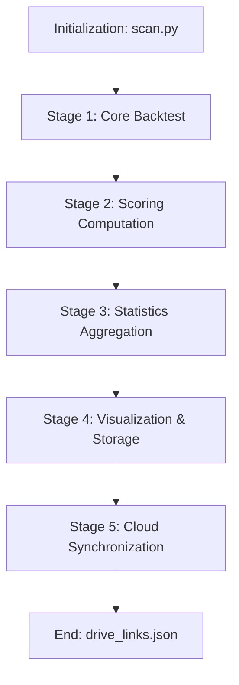

# GigaAlpha Workflow Architecture

This document provides a technical specification of the GigaAlpha execution pipeline, outlining the sequence of operations from configuration initialization to cloud-based artifact synchronization.

## Workflow Pipeline Overview

The execution process is orchestrated by the ScanPipeline class (located in gigaalpha/services/pipeline_service.py). The pipeline is structured into several discrete, sequential stages to ensure modularity and robust error handling.

---

## Operational Stages

### 1. Core Backtesting (run_backtest)
The primary computational stage involving high-concurrency parameter exploration.

- Services: BacktestService, Simulator.
- Logic:
    1. Configuration Loading: Parses YAML definitions to determine strategy targets.
    2. Grid Generation: Expands parameter ranges into a discrete execution matrix.
    3. Parallel Simulation: Distributes simulation tasks across multiple CPU cores using multiprocessing.
    4. Diagnostics: Individual failures are caught at the simulator level, logging full tracebacks without terminating the broader grid.

### 2. Scoring Computation (run_scoring)
An optional analytical stage that ranks strategy performance based on non-parametric models.

- Services: ScoringService.
- Logic:
    1. Result Loading: Retrieves the raw trading records generated in the Backtest stage.
    2. K-Neighbors Evaluation: Computes neighborhood-based Sharpe rankings to filter robust strategy parameters.
    3. Data Integration: Appends scoring metrics directly to the primary results DataFrame.

### 3. Statistics Aggregation (run_statistics)
The final numerical analysis stage for summarizing performance across different time segments.

- Services: StatisticsService.
- Logic:
    1. Transformation: Groups results by time segments and strategy identifies.
    2. Metric Calculation: Computes high-level statistics including Sharpe ratio distribution, TVR means, and success percentages.
    3. Reporting: Outputs a structured terminal summary for immediate researcher feedback.

### 4. Visualization and Storage (run_visualization_and_storage)
The stage responsible for generating tangible research artifacts.

- Services: VisualizationService, StorageService.
- Logic:
    1. Parallel Processing: Assigns segment-specific data to parallel workers for artifact generation.
    2. 3D Plotting: VisualizationService creates interactive Plotly HTML files for hyperparameter investigation.
    3. Archival: StorageService exports comprehensive metrics into professional-grade Excel workbooks.

### 5. Cloud Synchronization (run_upload_to_drive)
Ensures data persistence and collaborative access via automated cloud storage.

- Services: UploadService, TrackLink Utility.
- Logic:
    1. Artifact Identification: Detects new Excel workbooks in the storage directory.
    2. Parallel Upload: Uploads files to Google Drive using a dedicated OAuth2 service layer.
    3. Link Management: Updates the centralized drive_links.json tracker with verifiable Cloud URLs.

---

## Call Stack Reference

| Entry Point | Core / Service Context | Functional Purpose |
| :--- | :--- | :--- |
| scan.py | PipelineConfig.load() | Configuration normalization and I/O validation |
| ScanPipeline | BacktestService.run_parallel() | Multiprocessing orchestration of backtest workers |
| BacktestService | Simulator.execute_pipeline() | Execution of mathematical trading models |
| ScanPipeline | ScoringService.run_parallel() | Algorithmic ranking and neighbor analysis |
| ScanPipeline | run_upload_to_drive() | Interaction with Cloud Storage API layers |
| TrackLink | System.vn_time_converter() | Metadata timestamp generation (GMT+7) |

---

## Data Lifecycle Management
- Input Processing: Standardized .pickle files for high-velocity data ingestion.
- Adaptive Configuration: Behavioral definitions managed through segmented YAML profiles.
- Artifact Archival: Structured output directory (outputs/) with automated logging and audit trails.
